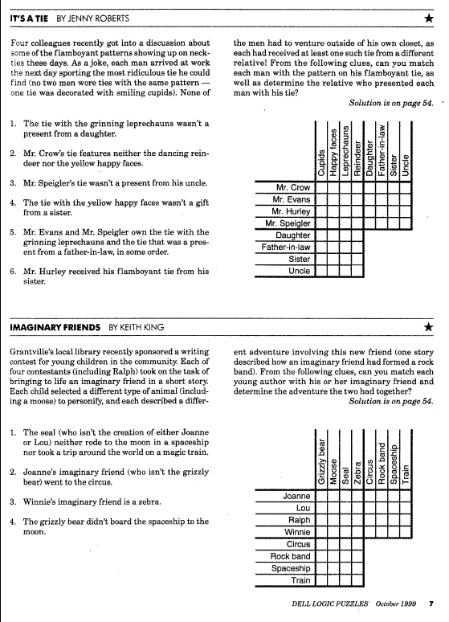
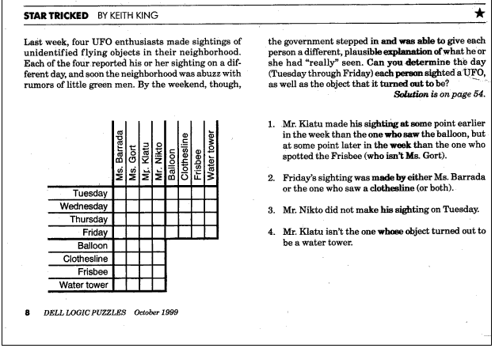

# CECS 342 Lab 4 - Logic Languages with SWI-Prolog

## Assignment Description

The purpose of this assignment is to give you some experience programming with logic programming. You will be using SWI-Prolog for this assignment.

### Part One: Logic Puzzles

To successfully complete this program, you will have to use lists in Prolog and provide solutions to the following logic problems along with your Prolog source code.

The three logic puzzles are as follows:

#### It’s a Tie

I have provided a [sample solution](tie.pl) for this in your repository. Use this as a model for your own solutions.

#### Imaginary Friends

The first part of your assignment is to write (and turn in) a Prolog program to solve this logic puzzle. Once you understand the *It’s a Tie* solution, this should be easy. Do this one first.

#### Star Tricked

The second part is to write (and turn in) a Prolog program to solve this logic puzzle. This one is a little trickier--you need to figure out how to describe the ordering of weekdays--but it’s not too hard.

These problems make unusually extensive use of the NOT operator, `\+`. Here’s what you need to know about this operator:

   * `\+` works as you would expect when all variables are completely instantiated (bound).
   * Prolog tries to prove things, so if expression E contains unbound variables, `\+E` will try to find variable bindings that will make E true.

It is easy to check whether a solution is correct: Just check whether it satisfied each of the numbered rules in the problem.

### Part Two: Adventure Game

Remember back to the first week of class? Guess what? You get to make another adventure game! This time, it’ll be in Prolog.

Your assignment is to write an adventure game in SWI-Prolog (almost like we did with Inform!). The requirements are exactly the same as the Inform assignment: pick any theme you like for your adventure game: rescue, survival, treasure hunt, "a day in the life", or whatever else appeals to you.

Copy the file [adventure.pl](adventure.pl) and use it as a starting point. This is an absolutely boring game consisting of one room, one object, and one direction you can go (but going in that direction takes you back to the same room). Add to this code to create your own game; if it doesn’t do what you want, fix it so that it does. This is free code, to use or modify any way you like. If you don’t want to use it, that’s okay too.

You can get additional ideas from the file [spider.pl](spider.pl)

Your program should contain one (or more, if you like) of each of the following:

   * **Locked door**. In its most boring form, you must find a key and use it to unlock a door, thus giving you access to one or more additional rooms. With a little more imagination: You aren’t admitted without a badge. You need to buy a ticket. You must give the troll a gold piece before you can cross the bridge. Waving the magic wand causes the rainbow bridge to appear. Et cetera. Any sort of locked door puzzle will do.
   * **Hidden object**. Boring form: You open a box and find something inside. More interesting: You break open a treasure chest. You use the combination to a safe. You peer into the crystal ball. You buy the candy bar from the vending machine. You disassemble the robot to get some part out of it.
   * **Incomplete object**. Your flashlight needs batteries. Your gun needs bullets. Your car needs gas. Your bicycle has a flat tire. You need a computer to get at the information on a floppy disk. You are a zombie and need a brain.
   * **Limited resources**. You have a limited amount of time (to find the bomb before it goes off) or money (to buy the things you need), or food, drink, or sleep (so you don’t collapse), or some other resource. Maybe you can find more resources in the game, maybe you can’t. Depending on just what you decide to do, you may want to figure out how to do arithmetic in Prolog.

You should have a `start/0` predicate (similar to the one provided in the source code of the [adventure.pl](adventure.pl) file) that I can use to start your game and find out what commands you have added. Don’t make me look at the code to figure out how to run your program!

Also include an inventory command (abbreviation: `i`) to tell what the player is currently holding.

Play the game by running Prolog and typing queries into it. Prolog can easily read Prolog terms, but reading anything else is awkward, and not worth learning how to do. (However, if you want to ask the user for a number, you can use the `read(X)` predicate; a number is a term. Just remember to type a period after the number.)

You may simply re-create the game that you made for the first assignment (as long as it meets all of the requirements), or you may do something completely new.

### Requirements for Part Two

Submit your `.pl` source code, a transcript of a sample run of your program, and a readme.txt file that briefly describes your game, and in particular briefly describes your locked door, hidden object, incomplete object, and limited resource. Make sure to also include the query file (or, at the very minimum, clear instructions on how to run your game) in order to receive credit.

## Deliverables

Submit your source code files (one file per part) through your git repository. Your submission must follow the following rules, *else I will not grade it and you will receive a zero for the submission*:

* You must include a query file specific for each Prolog code submission
* Do not use compression on your files
* Make sure that all significant code is *commented* with your own explanations
